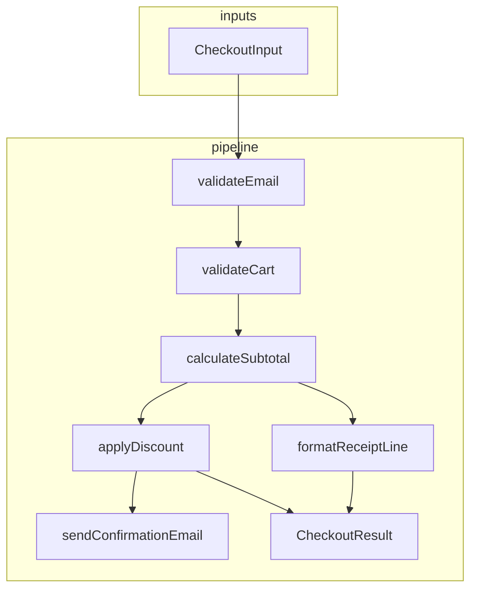
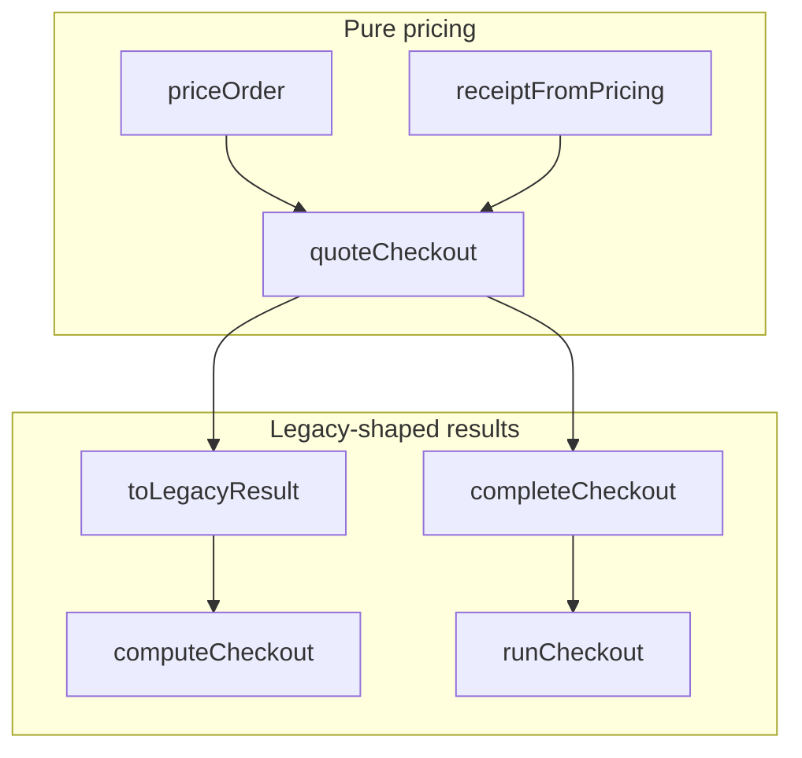

# Checkout refactor tutorial

**This is the main walkthrough for this repository.**

**Where to start:** You are already in the right document. Skim the next heading (**Quick start**), run the commands in the code block, then read **How to follow this tutorial** further down. If you landed on the repository’s **main page** on GitHub (or another host) instead, open the root **`README.md`**, use its Quick start (or follow its link back to this file under **`docs/TUTORIAL.md`**).

Checkout-refactor **tutorial codebase** with **snapshot folders** (`snapshots/00-baseline/` … `snapshots/07-migrate-shoehorn/`) so you can compare **code and tests** at each step. After you clone, **`src/`** and **`tests/`** at the repo root match **`snapshots/00-baseline/`**—the **starting** checkout. Use snapshots **01–07** as targets for **`src/`** and **`tests/`** only. **Reference writing** (brief, PRD, **phased plan**, checklists, etc.) lives only in the repo root **`docs/`** (step-prefixed filenames)—snapshots do **not** copy `docs/` (or repeat the plan file) so nothing drifts in two places.

---

## Quick start

```bash
git clone https://github.com/kujinlee/agent-skills-playground.git
cd agent-skills-playground
npm install
npm test
```

---

## How to follow this tutorial

### What’s wrong on purpose in `00-baseline`

`snapshots/00-baseline/` is a **deliberately imperfect** checkout example. It is useful because:

- **Shallow modules:** Logic is split across many small files, so the **end-to-end checkout story** is hard to see from one place. That sets up **improve-codebase-architecture**, **design-an-interface**, and **request-refactor-plan**.
- **Thin orchestration:** `runCheckout` wires pieces together; behavior and side effects are easy to mix up—good targets for **tdd** and **triage-issue**-style thinking.
- **Thin tests:** Only a couple of tests guard behavior, so gaps show up quickly when you extend the model (**tdd**).
- **Product vs code:** `docs/00-PRODUCT_BRIEF.md` describes loyalty and other rules that may not match the code yet—good fuel for **write-a-prd**, **prd-to-plan**, and **grill-me**.

None of that is accidental; it mirrors a real codebase you might refactor with an agent.

### Architecture: baseline vs step 07

This complements raw `diff` output: **what changes conceptually** between **`snapshots/00-baseline/`** and **`snapshots/07-migrate-shoehorn/`** (not a substitute for doing steps **01–07**).

#### Baseline (`snapshots/00-baseline/`)

**Role.** Checkout is a **single shallow pipeline**: validate email and cart, compute subtotal, apply a **coupon to the merchandise subtotal**, build receipt strings, send email, return a **legacy-shaped** `CheckoutResult`. The known product bug is that **PERCENT coupons** use the wrong basis when line-level discounts exist (documented in tests).

**Public surface.** **`runCheckout`** — the only behavior entry point exported from `checkout/index.ts`. **Types** — `CheckoutInput`, `CheckoutResult`, `Cart`, `Coupon`, etc.



**Boundaries.** **Pricing** (subtotal, coupon, total) and **side effects** (email) live in one orchestration function (`runCheckout`). There is no separate **quote** vs **complete** step; no injection point for **notifiers** beyond calling `sendConfirmationEmail` directly.

#### End state (`snapshots/07-migrate-shoehorn`)

**Role.** Checkout exposes a **layered API**: **pure pricing** (`priceOrder`, `quoteCheckout`), **legacy-compatible** totals (`computeCheckout`, `runCheckout`), and **completion with optional notification** (`completeCheckout`). Types describe **pricing snapshots**, **receipt views**, and **quotes** so tests and callers can depend on stable contracts. Loyalty (**points**, **multipliers**) is modeled on top of **line-level qualifying spend** after order-level discount allocation.

**Public surface (high level).**

- **`priceOrder`** — `PriceOrderInput` → `PricingSnapshot` (no I/O).
- **`quoteCheckout`** — pricing + `ReceiptView` as **`CheckoutQuote`**.
- **`receiptFromPricing`** — receipt strictly from pricing (deprecated extra param noted in source).
- **`computeCheckout`** — validated input → **legacy** `CheckoutResult` (no email).
- **`completeCheckout`** — quote + **optional `CheckoutNotifier`** (default sends email using legacy-shaped body for compatibility).
- **`runCheckout`** — same as today for callers: **legacy** `CheckoutResult` with email side effect.
- **`sendCheckoutConfirmationEmail`** — explicit export for tests/adapters.



**Boundaries (what refactoring added).**

| Concern | Baseline (00) | End state (07) |
|--------|-----------------|----------------|
| Coupon + line discounts | Easy to get wrong; one code path | **Allocated qualifying spend** per line; coupon applied on consistent basis |
| Pricing vs I/O | Mixed in `runCheckout` | **`computeCheckout`** vs **`completeCheckout`** / **`runCheckout`** |
| Receipt | String lines only | **`ReceiptView`** (+ optional structured `blocks`) |
| Extensibility | Fixed email call | **`CheckoutNotifier`** receives `quote` + legacy result |

#### How this fits with the rest of the tutorial

| Representation | Best for |
|----------------|----------|
| **This section** (concepts + diagrams) | Seeing *why* deeper boundaries and types matter between **00** and **07** |
| **Step-by-step sections below** | Actually doing the work with skills and artifacts |
| **`diff -ru` / your editor** on `snapshots/…/src` | Line-level edits and following real code — see [Compare snapshots](#compare-snapshots) |

The **file tree** under `checkout/` stays nine files at both ends; most of the delta is **types**, **new functions**, and **dependency direction** inside `runCheckout.ts` and related modules.

### Progression `01` → `07` (snapshots and skills)

Work **in order**. You **start** from baseline **`src/`** and **`tests/`** at the repo root. Each folder under `snapshots/` is a **frozen** tree for **code and tests** at the end of that stage: use `diff` against your project copy (see [Compare snapshots](#compare-snapshots)) to see what to aim for next, or copy a snapshot’s **`src/`** and **`tests/`** over the root if you want to **replay** or **skip** to a specific step—**`docs/`** (including **`docs/01-loyalty-points-checkout-plan.md`**) stays the single copy at the repo root. See [`snapshots/README.md`](../snapshots/README.md) for a short description of the snapshot layout.

**Quick index**

| Step | Snapshot folder |
|------|-----------------|
| 00 | `snapshots/00-baseline/` |
| 01 | `snapshots/01-product-and-design/` |
| 02 | `snapshots/02-day1-characterization/` |
| 03 | `snapshots/03-day1-day2-gates/` |
| 04 | `snapshots/04-day2-deep-boundaries/` |
| 05 | `snapshots/05-loyalty-and-regression/` |
| 06 | `snapshots/06-review-and-organize/` |
| 07 | `snapshots/07-migrate-shoehorn/` |

Install skills as you need them (see [Installing agent skills](#installing-agent-skills)). Below, **example prompts** are starting points—adapt them to your agent.

Supporting refactor material (checklists, RFC, issue, review, summary) lives in **`docs/`** with **`NN-` step prefixes** at the repo root only—see [Layout (reference)](#layout-reference).

---

#### Step 00 — `00-baseline`

- **Goal:** Understand the starting codebase and its intentional weaknesses (see **What’s wrong on purpose in `00-baseline`** above).
- **Artifacts:** None required; read `docs/00-PRODUCT_BRIEF.md` and `src/checkout/`.
- **Skills:** None—explore manually so you know what you are about to change.

---

#### Step 01 — `01-product-and-design`

- **Goal:** Align **product intent** and **technical direction** before heavy refactoring: what to build, how you might deepen the module, and how you will justify a larger change.
- **Typical artifacts:** A fuller **PRD** (`docs/01-PRD-loyalty-program.md`), an implementation **plan** (`docs/01-loyalty-points-checkout-plan.md` — use with **prd-to-plan**), a consolidation **issue** (`docs/01-ISSUE-checkout-consolidation-refactor.md`) and **RFC** (`docs/01-RFC-checkout-architecture-deepening.md`), and an expanded **product brief**. Code may already expose `computeCheckout` and related exports so the design discussion has something concrete to attach to.
- **Skills & usage examples:**
  - **write-a-prd** — e.g. *“Using `docs/00-PRODUCT_BRIEF.md` and this repo, draft a PRD for the loyalty program and checkout scope.”*
  - **prd-to-plan** — e.g. *“Turn that PRD into a phased plan with tracer-bullet slices.”*
  - **request-refactor-plan** — e.g. *“Interview me and produce a tiny-commit refactor plan for consolidating checkout.”*
  - **improve-codebase-architecture** — e.g. *“Explore `src/checkout/` for shallow-module problems; suggest deep-module boundaries only (no big rewrite yet).”*
  - **design-an-interface** — e.g. *“Propose 2–3 different public API shapes for checkout after a deeper core.”*

---

#### Step 02 — `02-day1-characterization`

- **Goal:** **Anchor behavior** with tests and types before you redraw module boundaries (“Day 1” characterization).
- **Typical artifacts:** Richer **`tests/checkout.test.ts`**, evolving **`types.ts`**, and a started **Day 1 checklist** (`docs/02-CHECKLIST-day-1-checkout-refactor.md`).
- **Skills & usage examples:**
  - **tdd** — e.g. *“Add characterization tests for current checkout behavior; one scenario at a time, green after each.”*  
    Use the checklist to ensure you have covered the behaviors you care about before step 04.

---

#### Step 03 — `03-day1-day2-gates`

- **Goal:** **Gate** the big refactor: both **Day 1 and Day 2 checklists** plus strict rubrics are in place **before** the deep boundary change (ideal teaching order; compare to `04` in `diff` to see the jump).
- **Typical artifacts:** Updated **Day 1** and full **Day 2** checklists with rubrics (`docs/CHECKLIST-day-1-…`, `docs/CHECKLIST-day-2-…`). Code is still the **pre-deep-refactor** shape from a test/typing perspective.
- **Skills & usage examples:**
  - **grill-me** (optional) — e.g. *“Grill me on whether I am ready to introduce `priceOrder` and split core vs adapters.”*
  - Otherwise: **human review** against the checklists; the artifacts are the rubric you fill in or discuss.

---

#### Step 04 — `04-day2-deep-boundaries`

- **Goal:** Implement **Day 2** structure: clear **core** vs **adapters** (e.g. pricing snapshot, quotes, completion paths, thin `runCheckout` / `computeCheckout`).
- **Typical artifacts:** New or refactored modules in **`src/checkout/`** (`priceOrder`, receipt/quote helpers, injected notifiers, etc.) and tests proving behavior is preserved or intentionally extended.
- **Skills & usage examples:**
  - **tdd** — e.g. *“Extract `priceOrder` with tests that lock snapshot shape; keep `runCheckout` as adapter.”*
  - **improve-codebase-architecture** — e.g. *“Given the new tests, propose the smallest set of files and responsibilities for the deep core.”*

---

#### Step 05 — `05-loyalty-and-regression`

- **Goal:** Match **product rules** (loyalty, qualifying spend, multipliers) and add **regression** coverage so refactors do not slip.
- **Typical artifacts:** Changes in **`runCheckout.ts`**, **`types.ts`**, and **`tests/checkout.test.ts`**; scenarios for edge cases and compatibility.
- **Skills & usage examples:**
  - **tdd** — e.g. *“Implement qualifying-spend semantics from the PRD/brief; add tests for stacking and failure cases.”*
  - **triage-issue** (optional) — e.g. *“Wrong totals when X and Y interact; root-cause in this repo and propose a TDD fix plan.”*

---

#### Step 06 — `06-review-and-organize`

- **Goal:** **Quality gate** plus **readable doc layout**: capture review outcomes and keep long-lived refactor docs as **step-prefixed files** under **`docs/`** (e.g. `06-…`).
- **Typical artifacts:** **Review** write-up (`docs/06-REVIEW-day-2-quality-gate.md`), **summary** of activities (`docs/06-SUMMARY-checkout-refactor-activities.md`), alongside the same ISSUE/RFC/checklists with consistent names.
- **Skills & usage examples:**
  - **grill-me** (optional) — e.g. *“Grill me on whether the Day 2 checklist is honestly complete.”*
  - Manual pass: fix gaps the review finds, then mirror the doc tree you see in this snapshot.

---

#### Step 07 — `07-migrate-shoehorn`

- **Goal:** Make **tests** safer and clearer by replacing brittle `as` casts with **`@total-typescript/shoehorn`** (`fromPartial`, etc.).
- **Typical artifacts:** **`package.json`** / lockfile dependency on shoehorn; **`tests/checkout.test.ts`** rewritten to use partial fixtures safely.
- **Skills & usage examples:**
  - **migrate-to-shoehorn** — e.g. *“Migrate `tests/checkout.test.ts` to shoehorn; no behavior change in production code.”*

---

When you finish step **07**, your project at the repo root should match **`snapshots/07-migrate-shoehorn/`** for `src/` and `tests/`. (`diff -ru snapshots/07-migrate-shoehorn/src src` and the same for `tests` should show no differences.) **`docs/`** is maintained separately at the root, not compared to snapshots.

---

## Installing agent skills

This project **does not** ship skill packages under `.claude/`, `.agents/`, or similar—those are created when **you** install skills. The installer is the open **[Skills CLI](https://github.com/vercel-labs/skills)** (Vercel Labs): `npx skills@latest …`. It targets a **generic** agent-skills layout; your editor or agent (Claude Code, Cursor, Codex, and others per [the Skills project](https://skills.sh)) decides how it consumes them. See the **[CLI docs](https://skills.sh/docs/cli)** and the **[`skills` package on npm](https://www.npmjs.com/package/skills)** for details.

```bash
npx skills@latest add mattpocock/skills/<skill-name>
```

**Credits:** Skills used in this tutorial come from **[Matt Pocock](https://github.com/mattpocock)**’s **[mattpocock/skills](https://github.com/mattpocock/skills)** collection. This repo does not bundle skill definitions.

### Skills used in this checkout tutorial

Install **as you go**, or use the loop at the end. Optional skills are marked.

| Skill | Install command |
|-------|-----------------|
| write-a-prd | `npx skills@latest add mattpocock/skills/write-a-prd` |
| prd-to-plan | `npx skills@latest add mattpocock/skills/prd-to-plan` |
| request-refactor-plan | `npx skills@latest add mattpocock/skills/request-refactor-plan` |
| improve-codebase-architecture | `npx skills@latest add mattpocock/skills/improve-codebase-architecture` |
| design-an-interface | `npx skills@latest add mattpocock/skills/design-an-interface` |
| tdd | `npx skills@latest add mattpocock/skills/tdd` |
| grill-me (optional) | `npx skills@latest add mattpocock/skills/grill-me` |
| triage-issue (optional) | `npx skills@latest add mattpocock/skills/triage-issue` |
| migrate-to-shoehorn | `npx skills@latest add mattpocock/skills/migrate-to-shoehorn` |

**Install all of the above in one go (optional):**

```bash
for s in write-a-prd prd-to-plan request-refactor-plan improve-codebase-architecture design-an-interface tdd grill-me triage-issue migrate-to-shoehorn; do
  npx skills@latest add "mattpocock/skills/$s"
done
```

---

## Compare snapshots

```bash
# Example: baseline vs product-and-design (code + tests)
diff -ru snapshots/00-baseline/src snapshots/01-product-and-design/src
diff -ru snapshots/00-baseline/tests snapshots/01-product-and-design/tests
```

---

## Layout (reference)

| Path | Meaning |
|------|---------|
| `docs/TUTORIAL.md` | This walkthrough (no step prefix) |
| `src/`, `tests/` | **Working tree** — starts as **00-baseline**; you evolve toward **07** |
| `docs/00-…` … `docs/06-…` | Reference docs by **tutorial step**, including **`docs/01-loyalty-points-checkout-plan.md`** (trial convention; see below) |
| `snapshots/00-baseline/` … `snapshots/07-migrate-shoehorn/` | **Frozen** `src/` + `tests/` per step—**no `docs/`**; see [`snapshots/README.md`](../snapshots/README.md) |

**Step prefixes on filenames (trial):** `00` product brief, `01` PRD / **loyalty phased plan** / issue / RFC, `02` Day 1 checklist, `03` Day 2 checklist, `06` review & summary. Everything lives directly under **`docs/`** (no `checkout-refactor/` folder, no `plans/`). If this feels noisy or brittle, we can drop the prefixes later—treat this layout as an experiment.
